# JC WooCommerce Advanced Attributes plugin
Author: James Collings  
Version: 2.0.9  
Created: 11/01/2015  
Updated: 23/02/2018

## About

Take control of WooCommerce product attribites and easily replace the default variable product dropdowns with Images, text, and Colour Swatches with JC WooCommerce Advanced Product Attributes. Select the default square, or modern circular attribute styles on a per attribute basis, giving your complete control of the look, if this is not enough the display can be tweaked further using the build in style settings page. 

With the display of improved attributes on your website, make it easier to manage product attributes with the introduction of attribute groups, allowing you to create sets of attributes that can be simpily loaded onto products with the click of a single button, saving you time and effort.

## Features
* Attribute Group Mangement
* Attribute Image, Colour Swatches, and Text

## Installation
1. Download a copy of the plugin
1. Copy the jc-woocommerce-advanced-attributes folder to your wordpress plugins directory, usually /wp-content/plugins/
1. Goto plugins page within Wordpress and activate JC WooCommerce Advanced Attributes plugin

## Documentation

__Table of Contents__

1. [Attribute Grouping Management](#attribute-group-management)
1. [Group Simple Product Attributes](#group-simple-product-attributes)
1. [Product Attribute Images and Colour Swatches](#product-attribute-images-and-colour-swatches)
1. [General Settings](#general-settings)

### Attribute Group Management

Manage attributes easily by creating attribute groups which can easily be added to products, removing the repetitive task of individually adding each attribute manual per product.

Attribute groups can be managed under __Product > Attribute Groups__, similar to posts management you are shown a paginated list of all attribute groups, where you can edit/delete exsiting attribute groups by hovering over the group name, or create new ones by clicking on the __Add new Attribute Group button__ displayed at the top of the page.

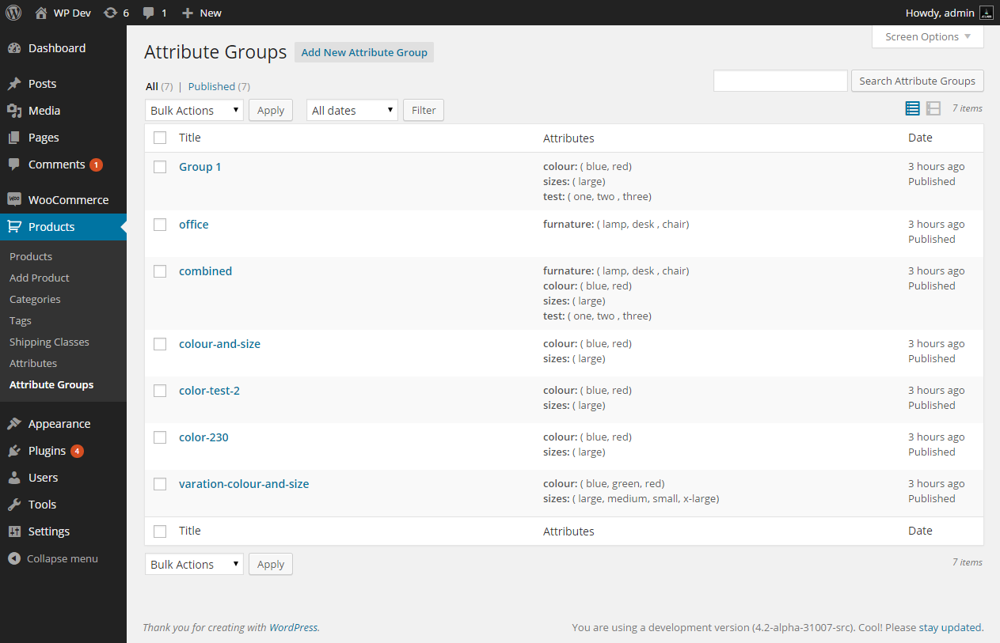

#### Add/Edit an attribute group

Once you have clicked on the add or edit button you should see a page where you can set the group title, and list attribites in the current group. You can manage the attributes exactly the same as you would do when editing a product.

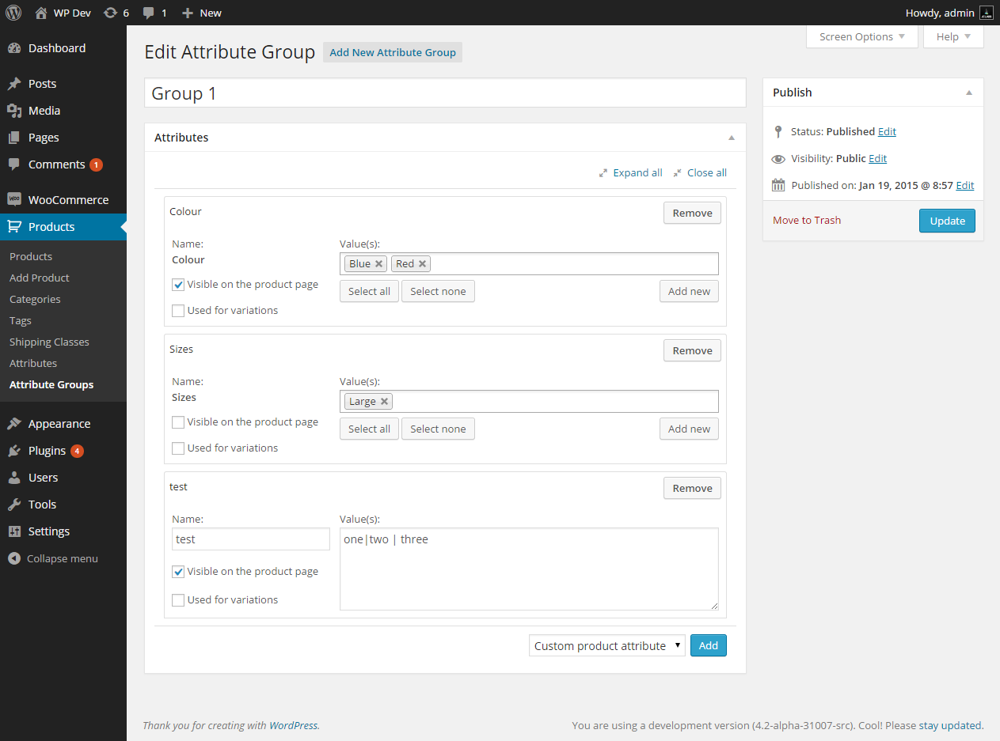

#### Loading an Attribute Group on a Product

To use an existing attribute group, goto the edit screen of the product you wish to edit and load up the product data attribute tab. Select the previously saved attribute group from the drop down (highlighted below) and click on the button labeled __Load__ to add the attribute group to the exsiting product attributes.

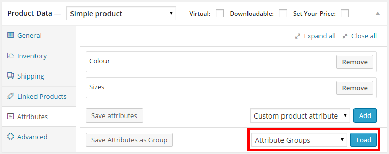

- - -

### Group Simple Product Attributes

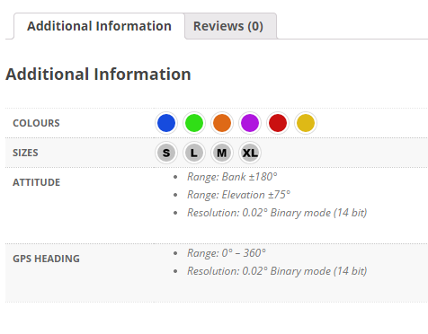

To group product attributes on the product information tab, Start by creating a new attribute by going to "Products > Attributes" and entering the following:

1. Name - since we want to create a attribute which is nested under a group we want to prefix that attribute with the group name e.g. (Attitude.Bank, Attitude.Elevation), this name will be used to uniquely identify that attribute within the admin area.
1. Under the advanced attributes display settings labelled Custom Label - enter the Name which you want it to appear under the Group e.g. (Bank, Elevation), this name will be displayed on the product information tab.
1. Check the Check box under the advanced attributes display settings labelled grouped
1. Repeat this for all attributes you want to group, keeping the same Group Prefix on attribute names, as this prefix will be used to group them.
1. To display attribute groups seperated by headings, check the general setting **Enable Theme Attribute Template Override**

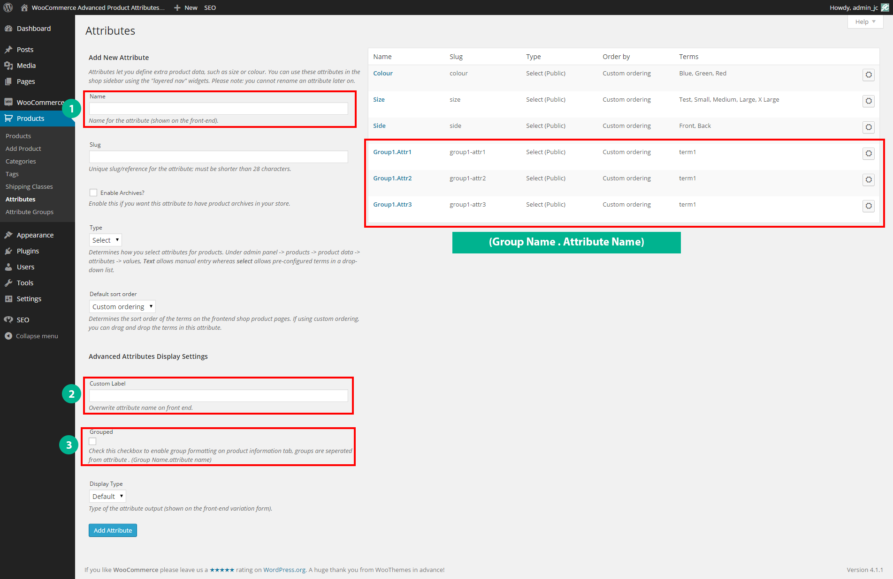

- - -

### Product Attribute Images and Colour Swatches

Transform your product pages and replace the default variation dropdowns with images, colour swatches, and text (as shown below).

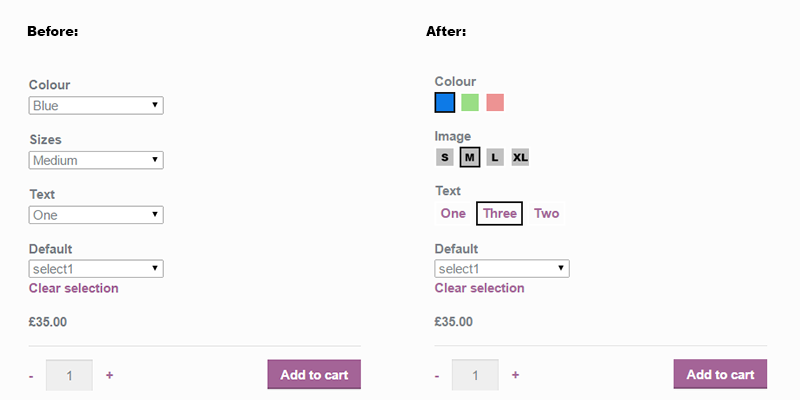

Transform your product information and include image and colour swatches in the attribute output section (as shown below).

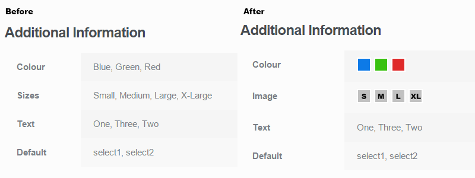

#### Change the output of an attribute

To change how terms within an attribute should be output, goto the add/edit screen for that attribute. You should see a new set of fields under the section titled Advanced Attribute Display Settings.

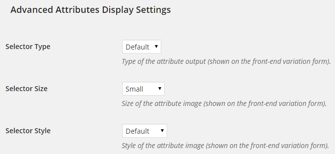

These settings will change how the attribute terms are displayed on the website.

__Selector type:__  
Change what format the attribute terms will be output (image, colour, text and default).

__Selector size:__  
Change the size of attribute terms (small, medium, large). These sizes can be changed in the general settings page.

__Selector style:__  
Change the style of the attribute terms, (default, rounded courners);

#### Add image or colour swatcher to attribute terms

Once you have configured the attribute display settings in the previous section, depending on the selector_type choice above will determine what is used to output the attribute term.

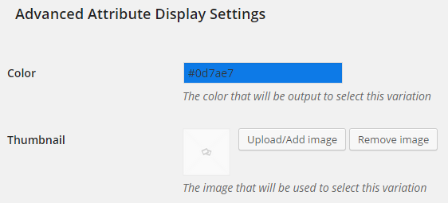

__Colour:__  
click on the input field and manually enter a hexadecimal colour code or select from the colour picker widget that loads up.

__Thumbnail:__  
Click on Upload/Add Image button to load up wordpress media uploader to select or upload an image, Click on Remove Image to clear the current selection.

### Settings
Plugin core settings can be accessed from __WooCommerce > Settings > Advanced Attributes__.

#### General Settings

The general settings section allows you to enable/disable featured of the plugin.

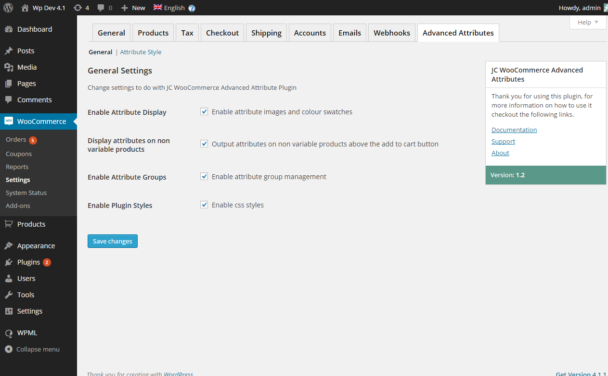

__Enable Attribute Display:__  
Toggle on/off the functionality of replacing product variation dropdowns with images, colour swatches, and text.

__Display attributes on non variable products:__
Toggle on/off the display of product attubutes on simple products before the add to cart button.

__Enable Attribute Groups:__  
Toggle on/off the functionality of attribute group management features.

__Enable Plugin Styles:__  
Toggle on/off the none core plugin styles.

__Enable Custom Plugin Validation:__
Enable the advanced attribute validation on variable products.

__Enable Theme Attribute Template Override:__
Enable plugin to override woocommerce attribute list, meaning for better display of grouped attributes.

#### Attribute Display Settings

Modify the look and feel of product attributes on product varions and product additional information tabs.

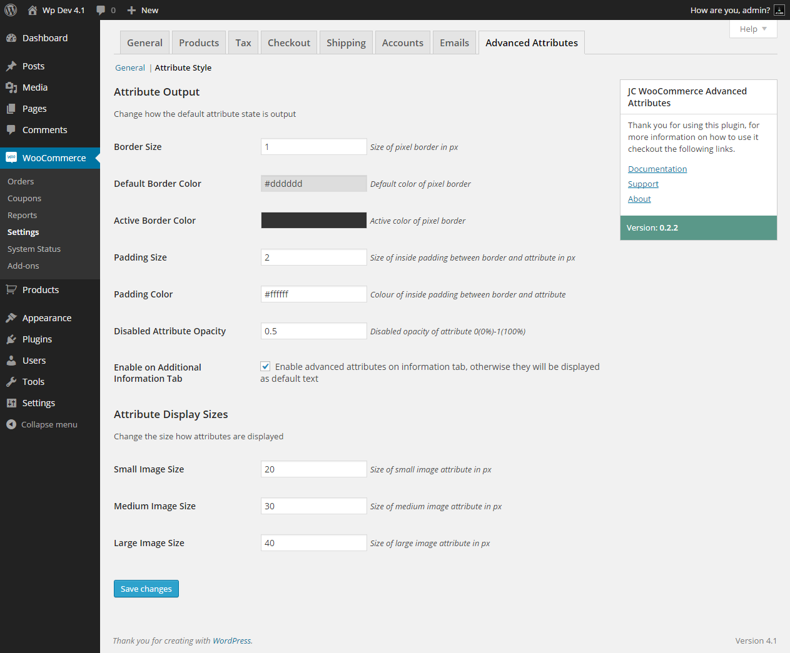

##### Attribute Output

__Border Size:__  
Set the numeric value of the outside border in pixels

__Default Border Color:__  
Set the color of the outside border

__Active Border Color:__  
Set the color of the attribute border when selected or hovered.

__Padding Size:__  
Set the numeric value of the inside padding in pixels

__Padding Color:__  
Set the color of the inside padding

__Disabled Attribute Opacity:__  
Set the opacity of a disabled option 0-1, 0 = 0% and 1 = 100%

__Enable on Additional Information Tab:__  
Toggle on/off the display of advanced attributes on the additional information tab.

__Choose Grouped Attributes Output:__
Display grouped attribute terms as list or table on product information tab.

##### Attribute Display Sizes

Set the size of advanced attributes.

__Small image size:__  
Set the size in pixels of the small attribute size.

__Medium image size:__  
Set the size in pixels of the medium attribute size.

__Large image size:__  
Set the size in pixels of the large attribute size.

## Changelog

### 2.0.9
* Pass null to third parameter when applying filter ```woocommerce_attribute_label```

### 2.0.8
* Add - New filter to return if you want to display the attribute on shop page `jcaa/display_archive_attribute`.

### 2.0.7
* Fix: attribute ordering and template to output grouped attributes

### 2.0
* Rewrite parts of plugin to be compatable with WC_Product_Attribute, version 2+ requires WooCommerce version 3
* Update admin group attributes to use term_id when saving and loading groups
* Fix notices and warnings.
* Stop WooCommerce WPML using the parent id when translating

### 1.5.10
* Fix: Compatibility for attribute groups with WPML

### 1.5.8
* FIX: allow for attribute groups such as ``` گروه یک.رنگ and گروه یک.سایز```

### 1.5.7
* FIX: and plugin mo & po files `/wp-content/plugins/jcaa-en_GB.mo`

### 1.5.6
* ADD: Add option for customers to not be able to click to deselect active attributes

### 1.5.5
* FIX: allow attributes to have names: 'رنگبندی' .

### 1.5.4
* ADD: Add the ability to add custom text attributes to attribute groups. 

### 1.5.3
* FIX: Allow multi-line text attributes (replace sanitize_text_field with esc_textarea)

### 1.5.2
* FIX: Slow page load when showing many attributes

### 1.5.1
* FIX: Warning message displayed if custom attribute values are left empty on group attribute page

### 1.5
* FIX: Attribute Group ordering
* FIX: visibility of hidden attributes
* NEW: POT file to /languages folder

### 1.4
* Override product attribute list on single product page, splitting into multiple tables with headings.
* Add integration with q-translate-x, allowing you to translate custom labels, and group names.

### 1.3.1
* Stopped styles and scripts being restricted to woocommerce only pages as this caused to many issues

### 1.3
* Changed product attribute loading for group from asynchronous to synchronous
* Integrated custom attribute validation

### 1.2.6
* Fixed missing js event variable when loading product attirbute groups
* Fixed only loading 10 attribute groups in dropdown

### 1.2.5
* Fixed automatic display of attributes on related products tab

### 1.2.4
* Added option to display attributes on product catalogue from edit attribute screen
* Added option to display grouped attributes in table or list from Attribute style settings

### 1.2.3
* Fixed errors when saving an edited attribute

### 1.2.2
* Fixed JS Issue when loading attribute group
* Added validation to disable options which aren't possible

### 1.2.1
* Added in html title attribute to show attribute name on hover
* Changed size of attribute in additional information tab
* Fixed JS issue when jcaa_attrs is null

### 1.2
* Added Compatability with WPML, localize text with jcaa
* Display Attributes on non variable products

### 1.1
* Allow creation of attribute managment groups without terms present
* Fixed attribute visibility and used for variation checkboxed switching
* Added ability to output grouped attributes using name format Group.Attribute by checking the attribute checkbox grouped (product information tab only)

### 1.0.2
* fixed firefox issue with not passing the correct $(this) element when a change event is triggered

### 0.2
* Added in product attribute grouping
* Minor Improvements and Bug fixes

### 0.1
* Plugin released